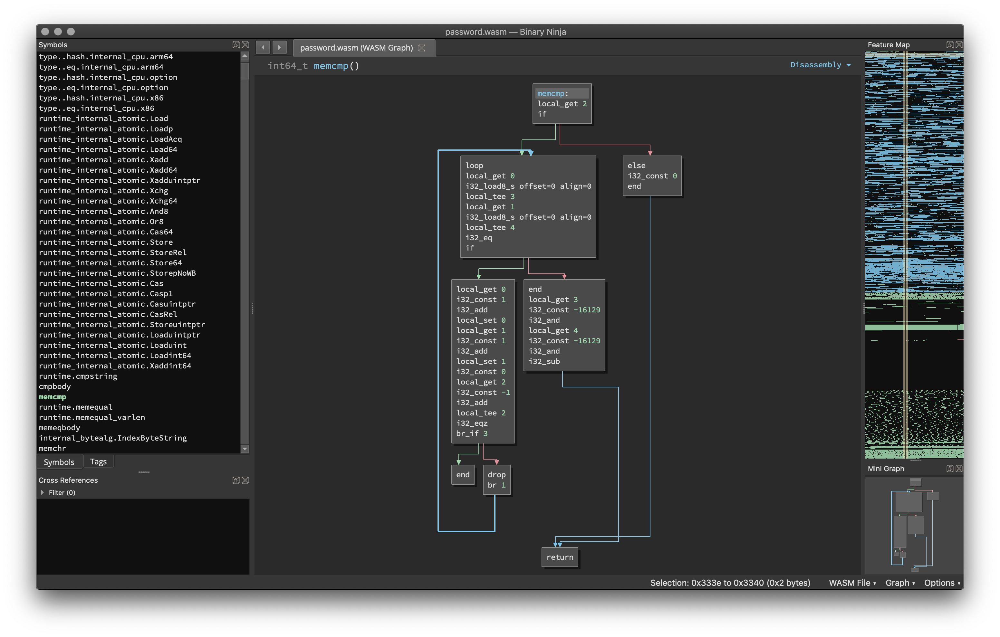

# binjawa



_A Binary Ninja plugin for WebAssembly._

## Description:

This is a plugin for disassembling and lifting WASM images.

## Minimum Version

This plugin requires the following minimum version of Binary Ninja:

 * 2170

## Installation

First install the necessary Python dependencies:

```
$ pip install -r requirements.txt
```

Then clone the plugin:

```
git clone https://github.com/CarveSystems/binjawa.git
```

and link the plugin into your Binary Ninja plugin directory:

### OS X

```
ln -s <clone_path>/binjawa ~/Library/Application\ Support/Binary\ Ninja/plugins/binjawa
```

### Linux

```
ln -s <clone_path>/binjawa ~/.binaryninja/plugins/binjawa
```

## License

This plugin is released under a [MIT](LICENSE) license.

